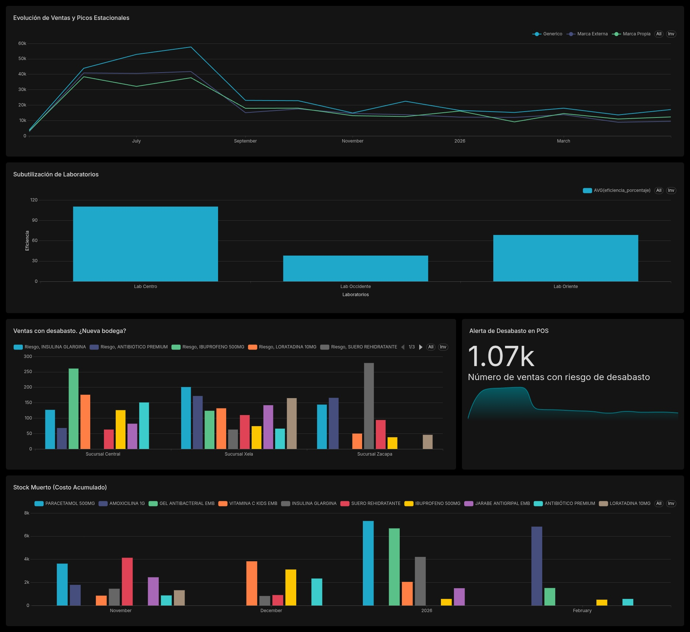

# Proyecto BI: Farmacia

## Arquitectura del sistema

## Fase de descubrimiento

### Perfil del Negocio

**Enfermito te ves mas bonito** es una cadena farmacéutica líder en Guatemala que integra toda la cadena de suministro: importación, fabricación propia en 3 laboratorios regionales (Oriente, Centro, Occidente), almacenamiento centralizado y venta en sucursales a nivel nacional.

### Stakeholders

| Rol | Interés Principal |
| --- | --- |
| **Gerencia de Logística** | Optimizar el espacio en bodega central y reducir costos de flete. |
| **Directores de Laboratorio** | Maximizar el uso de maquinaria y planificar producción según demanda. |
| **Administradores de Sucursal** | Evitar el desabasto y simplificar el proceso de pedido. |
| **Departamento Financiero** | Reducir el capital retenido en inventario de baja rotación. |

### Problemas identificados

El problema principal es que las ventas no están centralizadas, lo que impide una visión global de la demanda en tiempo real.

* **P1: Exceso de Stock Detenido:** Productos importados o fabricados que ocupan espacio pero no se venden.
* **P2: Cuello de Botella en Bodega Central:** El desorden físico se debe a la falta de una ventana de visibilidad sobre los flujos de entrada (importaciones) vs. salida (distribución).
* **P3: Falta de información en Laboratorios:** Se fabrica sin información. Es decir, sin considerar si la región de Occidente necesita más producto que la de Oriente.
* **P4: Fuga de Clientes:** El desabasto está haciendo que se pierdan clientes y vayan ala competencia.

### Sistemas Transaccionales

1. **Sistema Compras:** Datos de proveedores internacionales y tiempos de tránsito.

2. **Sistema Producción:** Capacidad instalada, registros de fallas de maquinaria y rendimiento de lotes.

3. **Sistema Bodega:** Ubicaciones físicas, estados de inspección y fechas de caducidad.

4. **Instancias POS:** Ventas diarias, niveles de stock local y comportamiento de compra del cliente final.

## Fase de Preparación

En esta etapa inicial se estableció el ecosistema técnico y funcional necesario para soportar el flujo de datos de **Enfermito te ves más bonito**.

* **Identificación de Fuentes:** Se definieron seis fuentes de datos que representan las operaciones críticas de la empresa:
* **Logística:** `logistics_db` (Catálogo e inventario central).
* **Compras:** `purchasing_db` (Proveedores y órdenes internacionales).
* **Producción:** `production_db` (Laboratorios y maquinaria).
* **Puntos de Venta (POS):** `pos_sucursal_1, 2 y 3` (Ventas locales y stock por tienda).

* **Configuración del Entorno:** Se desplegó una instancia de **PostgreSQL 17** y se configuró un entorno virtual de **Python 3.13** con las librerías `Pandas` (para transformación), `SQLAlchemy` (para orquestación de DB) y `python-dotenv` para la gestión segura de variables de entorno.
* **Aislamiento de Seguridad:** Se implementó un archivo `.env` para centralizar las credenciales de conexión, evitando la exposición de datos sensibles en los scripts de código fuente.

## Fase de Planeación

El diseño se centró en convertir datos transaccionales dispersos en un modelo analítico optimizado para consultas de alto rendimiento.

* **Modelado Dimensional:** Se optó por un **Esquema en Estrella (Star Schema)** para el Data Warehouse (`dwh`). Este modelo separa los datos en:
* **Dimensiones:** Entidades descriptivas (`dim_producto`, `dim_tiempo`, `dim_sucursal`, `dim_laboratorio`) que permiten filtrar y segmentar la información.
* **Hechos:** Tablas cuantitativas (`fact_ventas`, `fact_inventario`, `fact_produccion`) que almacenan métricas y llaves foráneas.

* **Estrategia de ETL (Extract, Transform, Load):** Se decidió utilizar un enfoque **E-T-L basado en Python**. Python permite una limpieza de datos más profunda, manejo de excepciones y cálculos de negocio complejos fuera del motor de la base de datos para no afectar el rendimiento transaccional.
* **Definición de Lógica de Negocio:** Se planificaron indicadores clave como el **Riesgo de Desabasto** (comparativa de stock vs. mínimo), la **Eficiencia de Producción** y la **Estacionalidad de Ventas**.

## Fase de Construcción

Aquí se en práctica la arquitectura mediante scripts de SQL y Python

* **Infraestructura SQL:** Se ejecutaron los scripts de creación de las bases de datos origen y el esquema del DWH, asegurando la integridad referencial y el uso de tipos de datos adecuados
* **Desarrollo del Pipeline de Datos (Python):** Se construyó un script robusto que realiza tres tareas fundamentales:
1. **Extracción:** Conexión concurrente a las bases de datos locales y lectura hacia DataFrames de Pandas.
2. **Transformación:** Normalización de nombres (UPPERCASE), cálculo de métricas (Costo de almacenamiento acumulado, eficiencia porcentual) y limpieza de valores nulos.
3. **Carga:** Inserción de datos en el DWH mediante una estrategia de *Upsert* para dimensiones (evitando duplicados) y carga completa/incremental para los hechos.

* **Integración con Apache Superset:** Se crearon los **Datasets virtuales** mediante consultas SQL complejas que unen las dimensiones con los hechos, preparando el terreno para la visualización final.

## Fase de comunicación

## Fase de Operacionalización

Esta fase describe cómo el proyecto pasará de ser un script manual a una solución empresarial sostenible.

* **Programación de Tareas (Scheduling):** Se propone el uso de una herramienta de orquestación como **Apache Airflow** o, en su defecto, un **Cron Job** de sistema para ejecutar el script de ETL de forma automatizada cada madrugada (ej. 2:00 AM), asegurando que los tomadores de decisiones tengan datos frescos al iniciar el día.
* **Estrategia de Crecimiento:** El sistema se diseñó de forma modular. Para agregar una nueva sucursal (`pos_sucursal_4`), solo es necesario añadir su cadena de conexión al script de Python y al archivo `.env`, sin necesidad de reescribir la lógica de las dimensiones o los hechos.