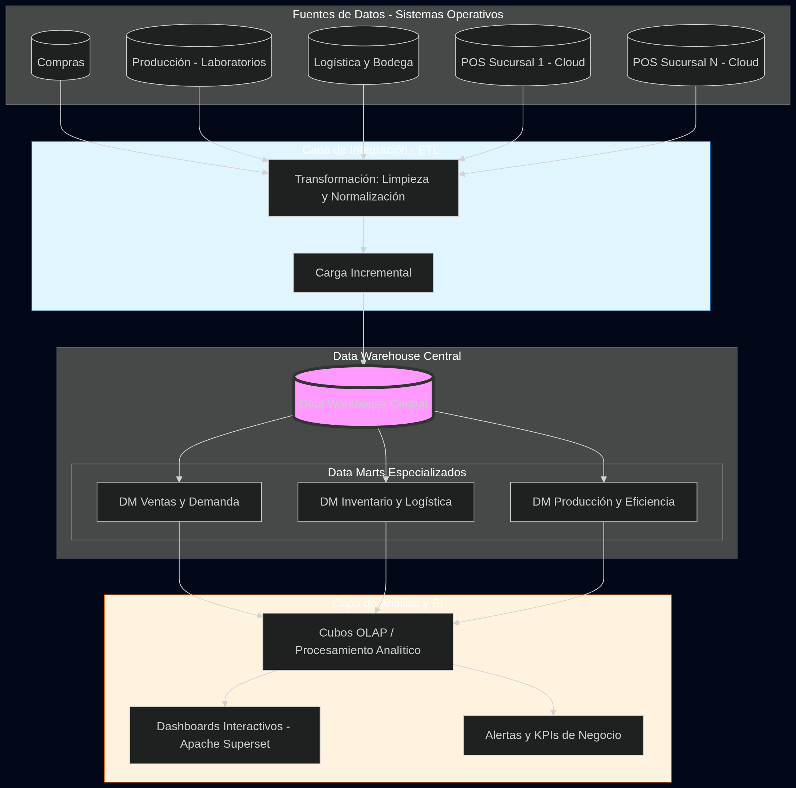
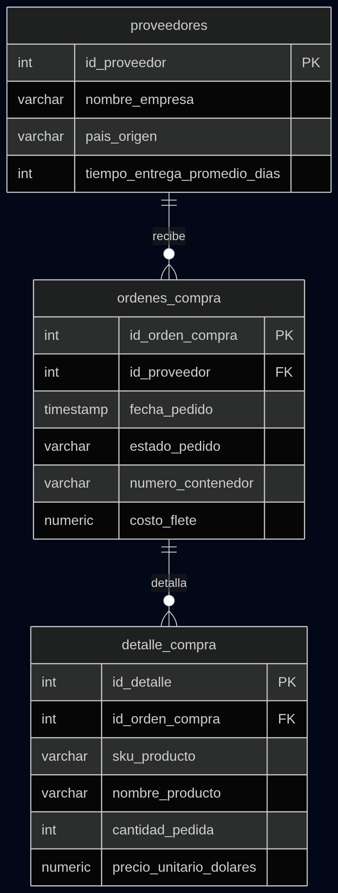
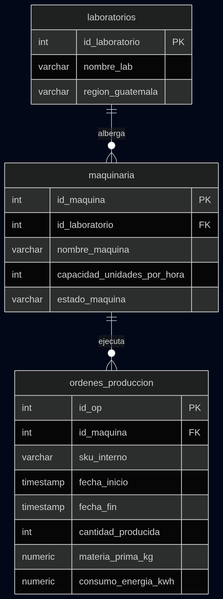
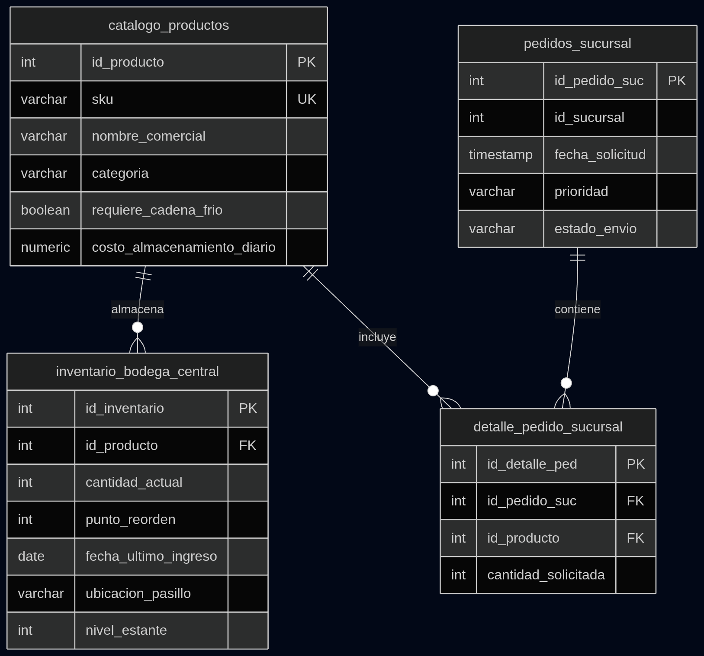
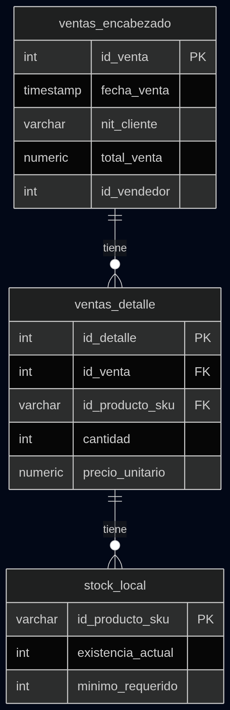

# Proyecto BI: Farmacia

## Arquitectura del sistema

## Fase de descubrimiento

### Perfil del Negocio

**Enfermito te ves mas bonito** es una cadena farmacéutica líder en Guatemala que integra toda la cadena de suministro: importación, fabricación propia en 3 laboratorios regionales (Oriente, Centro, Occidente), almacenamiento centralizado y venta en sucursales a nivel nacional.

### Stakeholders

| Rol | Interés Principal |
| --- | --- |
| **Gerencia de Logística** | Optimizar el espacio en bodega central y reducir costos de flete. |
| **Directores de Laboratorio** | Maximizar el uso de maquinaria y planificar producción según demanda. |
| **Administradores de Sucursal** | Evitar el desabasto y simplificar el proceso de pedido. |
| **Departamento Financiero** | Reducir el capital retenido en inventario de baja rotación. |

### Problemas identificados

El problema principal es que las ventas no están centralizadas, lo que impide una visión global de la demanda en tiempo real.

* **P1: Exceso de Stock Detenido:** Productos importados o fabricados que ocupan espacio pero no se venden.
* **P2: Cuello de Botella en Bodega Central:** El desorden físico se debe a la falta de una ventana de visibilidad sobre los flujos de entrada (importaciones) vs. salida (distribución).
* **P3: Falta de información en Laboratorios:** Se fabrica sin información. Es decir, sin considerar si la región de Occidente necesita más producto que la de Oriente.
* **P4: Fuga de Clientes:** El desabasto está haciendo que se pierdan clientes y vayan ala competencia.

### Sistemas Transaccionales

1. **Sistema Compras:** Datos de proveedores internacionales y tiempos de tránsito.

2. **Sistema Producción:** Capacidad instalada, registros de fallas de maquinaria y rendimiento de lotes.

3. **Sistema Bodega:** Ubicaciones físicas, estados de inspección y fechas de caducidad.

4. **Instancias POS:** Ventas diarias, niveles de stock local y comportamiento de compra del cliente final.

